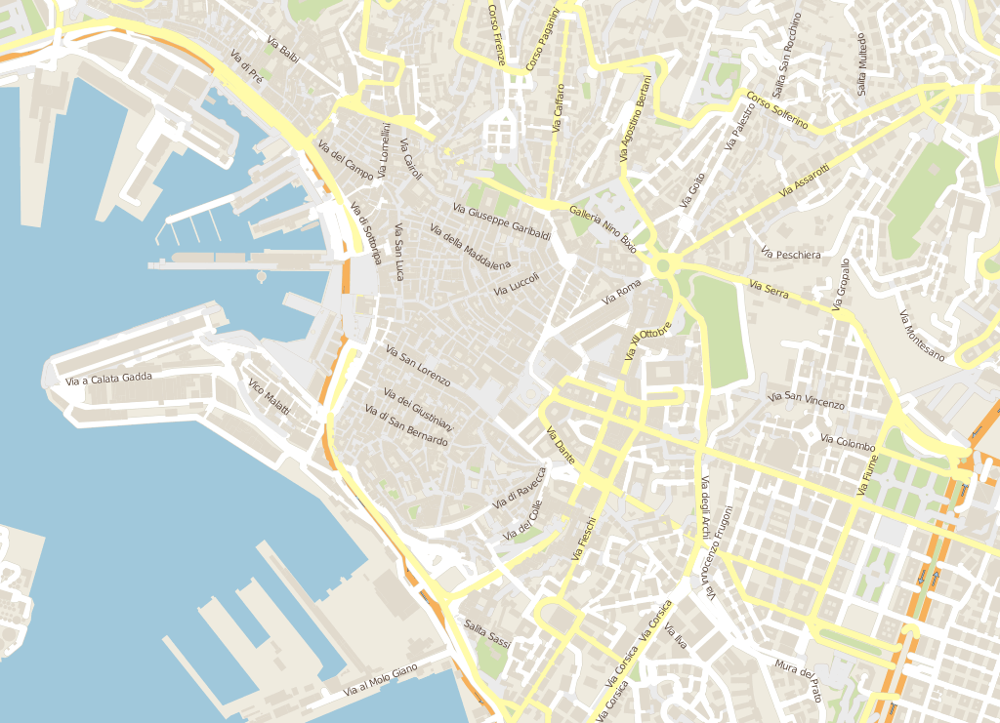
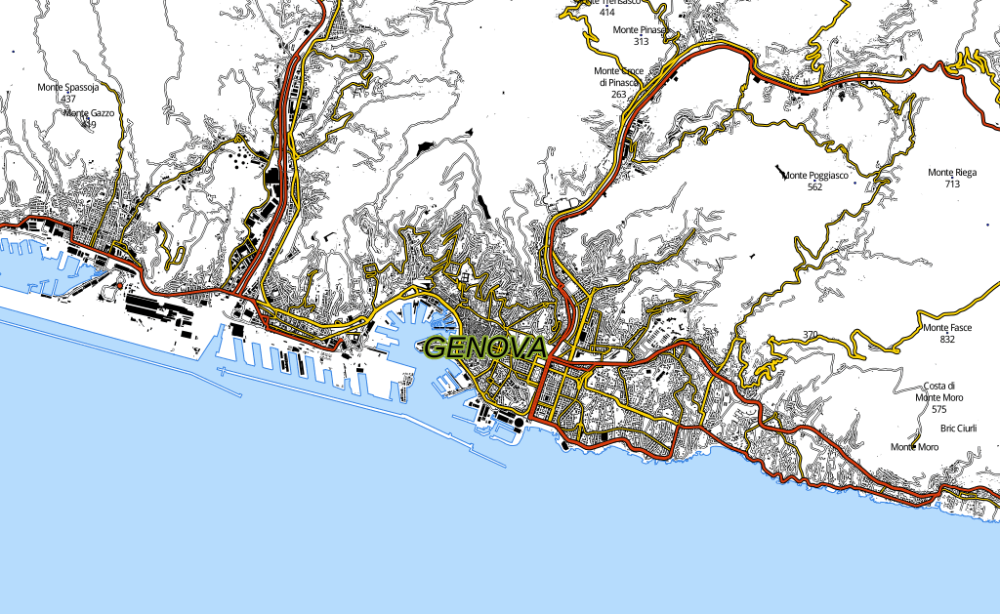

TilemillStyles
==============

My Tilemill tests.
I use a data directory for shapefiles inside the Documents/MapBox folder (to not duplicate them).
To add username and password simply search and replace into the project.mml.
The chosen license is LGPL v3.0, so please if you want to expand these styles contribute back the data.

TuttoCittOSM
--------
Inspired by the TuttoCittà web map ( http://www.tuttocitta.it/ ).

OpenTouring
---------
Inspired by the Touring Club Italiano Road Atlas.

